# Drone Security Analyst Agent

An intelligent AI-powered security monitoring system that analyzes drone video feeds in real-time to detect threats, identify objects, and generate actionable security alerts. The system uses Qwen2-VL for scene understanding, hybrid spatial-temporal memory (SQLite + ChromaDB), and Qwen2.5-1.5B-Instruct for contextual threat validation and natural language Q&A.

> [!IMPORTANT]
> **Project Deliverables:**
> - 📄 **[Detailed Project Report (PDF)](assets/FlytBase%20Report%20Neel%20Shah.docx.pdf)**: Detailed report covering design decisions, model selections, database schemas, prompt engineering, and visual results.
> - 📂 **All diagrams and screenshots** are available under the [`assets/`](assets) directory.

---

## System Overview

Below are the detailed system architecture and frame processing pipeline diagrams.

### System Architecture


### Frame Processing Pipeline


---

## Key Features

- **Real-Time Frame Processing**: GPU-accelerated video streaming and frame extraction via OpenCV with optimized MPEG-aware queue handling.
- **Intelligent Scene Description**: Generates semantic descriptions and structured object categories using Qwen2-VL-2B-Instruct with low-light CLAHE enhancement.
- **Hybrid Alerting System**: Combines LLM-driven threat evaluation (Qwen2.5-1.5B-Instruct) with embedding-similarity fallback to flag loitering, perimeter breaches, and repeat vehicle visits.
- **Spatial-Temporal Memory**: Stores structured metadata in SQLite for temporal queries and frame embeddings in ChromaDB for semantic similarity search.
- **Natural Language Q&A**: Ask the LangChain agent questions such as *"How many vehicles appeared more than once today?"* or *"Was anyone loitering near the perimeter gate at night?"* and receive contextual answers backed by Hybrid BM25 + vector search (RRF fusion).
- **Interactive Dashboard**: A Streamlit UI providing real-time metrics, live alert logs with frame image proof, historical frame searches, Q&A, and shift report exports.

---

## Architecture

### Component Map

| Component | File | Responsibility |
| :--- | :--- | :--- |
| Video Reader | `src/video_stream.py` | Thread-safe OpenCV stream; MPEG-aware full-decode sampling |
| VLM Processor | `src/vlm_processor.py` | Qwen2-VL-2B; structured JSON output; CLAHE image enhancement |
| Frame Description | `src/frame_description.py` | Bridge from raw frame to `FrameDescription` via VLM |
| Frame Indexer | `src/frame_indexer.py` | SQLite + optional ChromaDB persistence and query layer |
| Alert Engine | `src/alert_engine.py` | LLM-primary + embedding-similarity fallback hybrid alerting |
| Security Agent | `src/agent.py` | LangChain-style orchestrator; BM25 + vector RRF hybrid search; Q&A |
| Live Pipeline | `src/live_pipeline.py` | End-to-end video-to-JSON orchestrator with frame image export |
| Dashboard | `src/dashboard.py` | Streamlit UI: metrics, alerts, frames, Q&A, reports |
| Config | `src/config.py` | All tuneable parameters as frozen dataclasses |

### Database Schema

```sql
-- Frames table: one row per analyzed video frame
CREATE TABLE frames (
    id           INTEGER PRIMARY KEY AUTOINCREMENT,
    frame_id     INTEGER UNIQUE NOT NULL,
    timestamp    TEXT NOT NULL,         -- ISO-8601
    location     TEXT NOT NULL,
    description  TEXT NOT NULL,         -- VLM-generated
    objects      TEXT NOT NULL,         -- JSON array
    activity_type TEXT NOT NULL,        -- vehicle | person | vehicle+person | empty
    threat_score INTEGER DEFAULT 0,
    created_at   TIMESTAMP DEFAULT CURRENT_TIMESTAMP,
    telemetry    TEXT                   -- JSON: GPS, altitude, battery
);

-- Alerts table: one or more alerts per triggering frame
CREATE TABLE alerts (
    id           INTEGER PRIMARY KEY AUTOINCREMENT,
    frame_id     INTEGER NOT NULL REFERENCES frames(frame_id),
    alert_type   TEXT NOT NULL,
    severity     TEXT NOT NULL,         -- LOW | MEDIUM | HIGH | CRITICAL
    threat_score INTEGER NOT NULL,      -- 1-10
    message      TEXT NOT NULL,
    created_at   TIMESTAMP DEFAULT CURRENT_TIMESTAMP
);
```

### Alert Engine Logic

```
Frame arrives
    |
    +-- [LLM available?] -yes-> Qwen2.5 evaluates scene
    |                            Returns JSON: {alert, alert_type, severity, threat_score, message}
    |
    +-- [LLM not loaded] ------> Embedding similarity vs. threat phrases
                                 Threshold: cosine similarity > 0.50

Contextual checks (always run):
    - Repeat vehicle visits across frame history
    - Sustained dwell time at a single location (configurable threshold)
```


### Q&A Retrieval (Hybrid Search)

```
User question
    |
    +-- BM25 keyword search over all frame descriptions
    +-- ChromaDB semantic embedding search
    |
    Reciprocal Rank Fusion (RRF, k=60) merges both ranked lists
    |
    Top-10 frames passed as context to Qwen2.5 for answer generation
```


---

## Installation & Setup

### 1. Set Up Environment

Python 3.9+ is required. Clone the repository and initialize a virtual environment:

```bash
git clone <repo-url>
cd flytbaseAI
python -m venv venv
source venv/bin/activate
pip install -r requirements.txt
```

### 2. Verify GPU Access (Recommended)

Verify PyTorch can access CUDA to accelerate model inference:

```bash
python -c "import torch; print(f'GPU Available: {torch.cuda.is_available()}'); print(f'Device: {torch.cuda.get_device_name(0) if torch.cuda.is_available() else \"CPU\"}')"
```

### 3. Pre-download Models

To avoid timeout errors during first run, pre-download the models:

**VLM (Qwen2-VL-2B-Instruct):**
```bash
python -c "from transformers import AutoProcessor; AutoProcessor.from_pretrained('Qwen/Qwen2-VL-2B-Instruct'); print('VLM model OK')"
```

**LLM (Qwen2.5-1.5B-Instruct):**
```bash
python -c "from transformers import AutoTokenizer; AutoTokenizer.from_pretrained('Qwen/Qwen2.5-1.5B-Instruct'); print('LLM model OK')"
```

---

## Quick Commands Reference

| Task | Command |
| :--- | :--- |
| Process video file | `python src/live_pipeline.py --video <path> --fps 0.5 --export results.json` |
| Start dashboard | `streamlit run src/dashboard.py` |

---

## Usage Patterns

### Pattern 1: One-Shot Video Analysis

Process a video file and export findings to JSON:

```bash
python src/live_pipeline.py \
  --video sample_data/09172008flight1tape1_5.mpg \
  --fps 0.5 \
  --export results.json
```

To loop continuously (live feed simulation):

```bash
python src/live_pipeline.py \
  --video sample_data/09172008flight1tape1_5.mpg \
  --fps 0.5 \
  --loop \
  --export results.json
```

### Pattern 2: Live RTSP Stream

Configure the system to read from a drone RTSP transmitter:

```bash
python src/live_pipeline.py \
  --video rtsp://192.168.1.100:554/live \
  --fps 1.0 \
  --loop \
  --export live_results.json
```

### Pattern 3: Append Multiple Videos

Accumulate results from several video segments into one JSON file:

```bash
python src/live_pipeline.py --video part1.mpg --fps 0.5 --export results.json
python src/live_pipeline.py --video part2.mpg --fps 0.5 --export results.json --append
```

### Pattern 4: Programmatic Database Querying

```python
from src.frame_indexer import FrameIndexer

db = FrameIndexer("data/frames.db")

# Query by detected object keyword
vehicles = db.query_by_object("vehicle")
print(f"Found {len(vehicles)} vehicle incidents.")

# Query by location
gate_frames = db.query_by_location("Main Gate")
print(f"Found {len(gate_frames)} frames at Main Gate.")

db.close()
```

### Pattern 5: Programmatic Natural Language Q&A

```python
from src.agent import SecurityAnalystAgent

agent = SecurityAnalystAgent()
response = agent.answer_question(
    "Show all loitering incidents at night and summarize repeat visitors."
)
print(response)
agent.close()
```

### Pattern 6: Interactive Dashboard

```bash
streamlit run src/dashboard.py
# Opens at http://localhost:8501
```

Use the sidebar to load a `results.json` exported by the pipeline, then:
- Browse the **Dashboard** tab for key metrics and alert timeline
- Use the **Frames** tab to view thumbnails of saved frame images
- Use the **Alerts** tab to review alerts with frame image proof
- Use the **Q&A** tab to ask natural language questions with source citations
- Use the **Summary Report** tab to generate and download a shift report

#### Dashboard Screenshots Gallery

<details>
<summary>📸 Click to view Dashboard & Navigation Screenshots</summary>

| Screenshot | Screenshot |
|---|---|
| 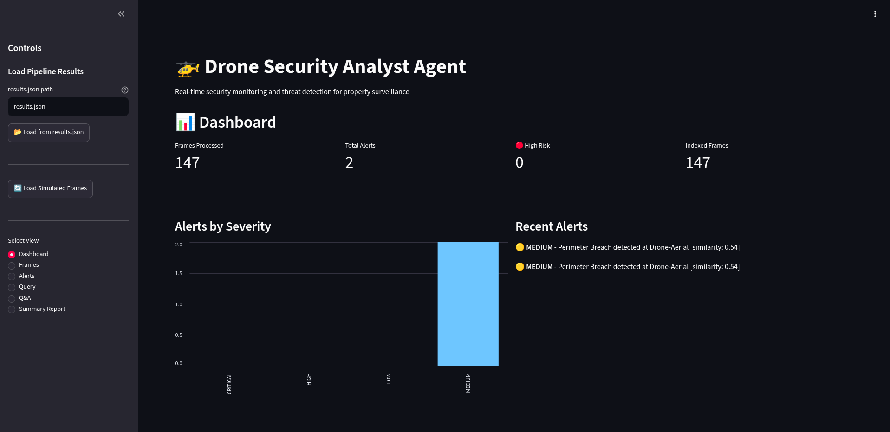 | 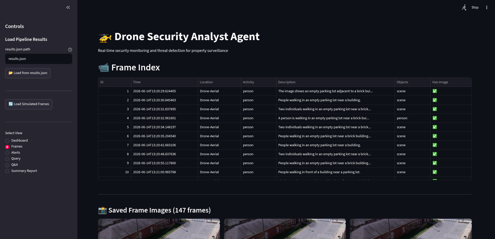 |
| 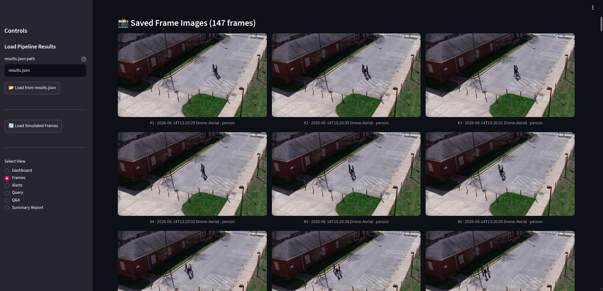 | 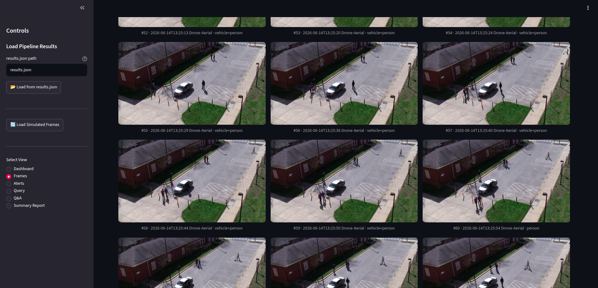 |

</details>

<details>
<summary>📸 Click to view Frame Analysis & Alert Proofs</summary>

| Screenshot | Screenshot |
|---|---|
| 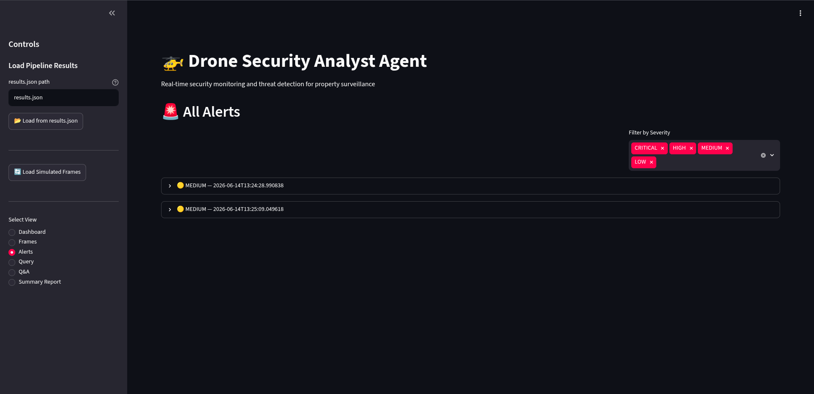 | 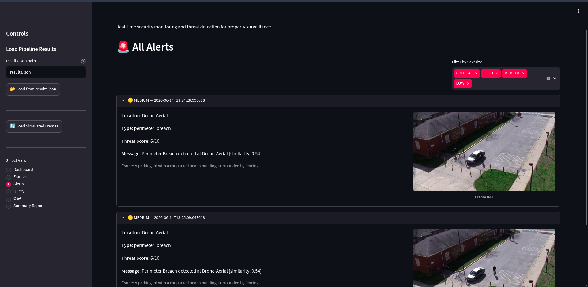 |
| 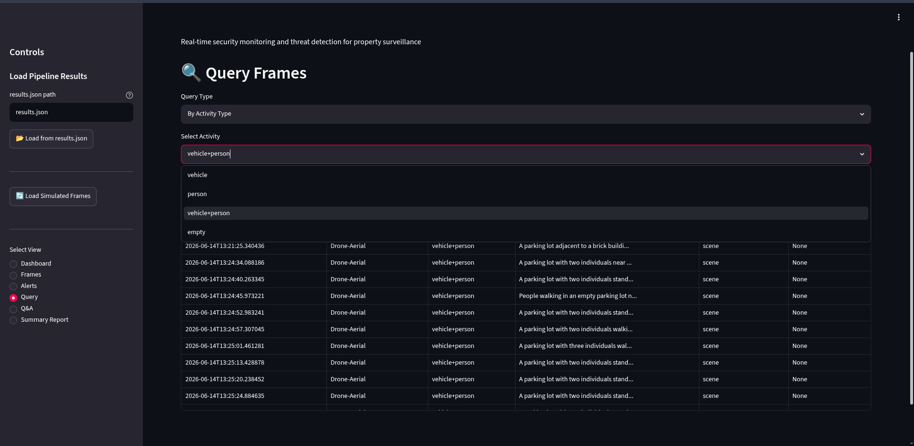 | 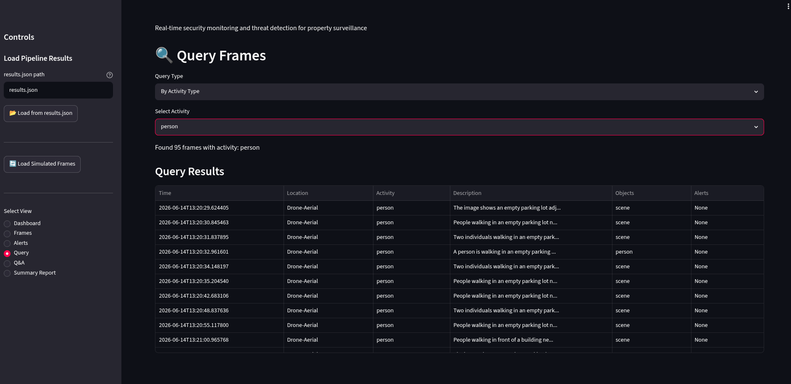 |
| 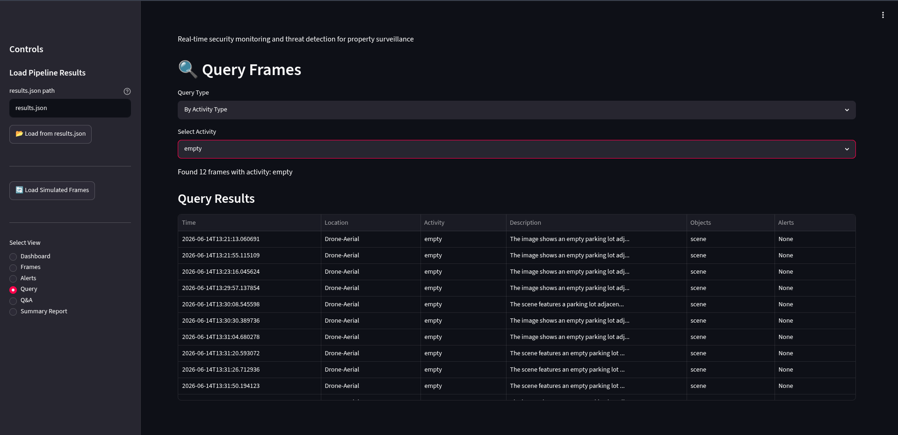 | |

</details>

<details>
<summary>📸 Click to view Q&A Interface & Summary Reports</summary>

| Screenshot | Screenshot |
|---|---|
| 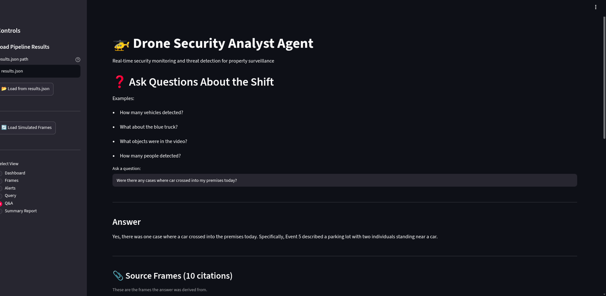 | 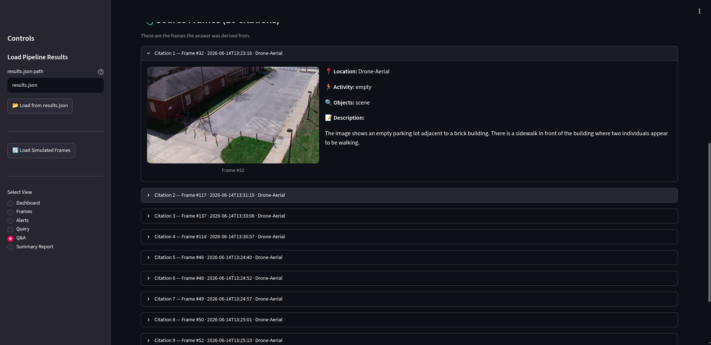 |
| 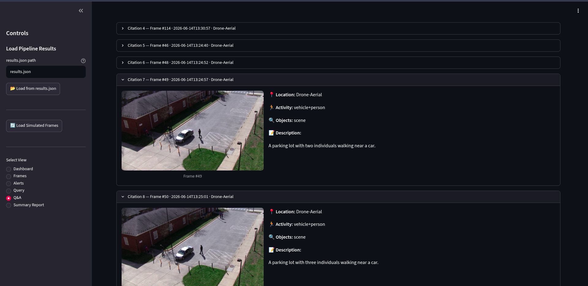 | |

</details>

---

## Configuration Guide

All configuration defaults live in `src/config.py` as frozen dataclasses.

### Alert Rule Config (`AlertRuleConfig`)

| Parameter | Default | Description |
| :--- | :--- | :--- |
| `loitering_hours` | `(23, 0, 1, 2)` | Hours that trigger loitering alerts |
| `night_vehicle_hours` | `(23, 0, 1, 2, 3, 4, 5, 6)` | Off-hours for night vehicle alerts |
| `loitering_threat_score` | `8` | Threat score for loitering (1-10) |
| `perimeter_threat_score` | `6` | Threat score for perimeter breach |
| `dwell_time_min_frames` | `3` | Minimum frames to trigger dwell alert |
| `dwell_time_min_minutes` | `240` | Minimum dwell duration (minutes) |

### VLM Config (`VLMConfig`)

| Parameter | Default | Description |
| :--- | :--- | :--- |
| `model_repo` | `Qwen/Qwen2-VL-2B-Instruct` | HuggingFace model repository |
| `max_new_tokens` | `256` | Maximum tokens for VLM output |

### LLM Config (`LLMConfig`)

| Parameter | Default | Description |
| :--- | :--- | :--- |
| `model_repo` | `Qwen/Qwen2.5-1.5B-Instruct` | HuggingFace model repository |
| `device` | `cuda` | Target device (`cuda` or `cpu`) |
| `max_new_tokens` | `256` | Maximum tokens for LLM output |
| `temperature` | `0.1` | Sampling temperature |

### CLI Overrides (live_pipeline.py)

| Flag | Description |
| :--- | :--- |
| `--video <path>` | Source video file or RTSP stream URL |
| `--fps <float>` | Processing rate (e.g. `0.5` = 1 frame every 2s) |
| `--db <path>` | Path to SQLite database |
| `--export <path>` | JSON export location |
| `--loop` | Loop the video continuously |
| `--append` | Merge with existing export file |

---

## Sanity Verification

```bash
# Component sanity checks
python -c "from src.frame_indexer import FrameIndexer; db = FrameIndexer('data/test.db'); print('Indexer OK'); db.close()"
python -c "from src.alert_engine import AlertEngine; engine = AlertEngine(); print('Alert Engine OK')"
python -c "from src.agent import SecurityAnalystAgent; agent = SecurityAnalystAgent(); print('Agent OK'); agent.close()"
```

---

## Project Structure

```
flytbaseAI/
|-- README.md                   # This document
|-- requirements.txt            # Python dependencies
|-- .gitignore
|
|-- prompts/                    # Centralized prompt templates package
|   |-- __init__.py             # Exposes all prompts
|   |-- vlm_analysis.py         # Prompt for VLM frame analysis
|   |-- agent_qa.py             # Prompt for agent-based Q&A
|   |-- alert_enrichment.py     # Prompt for alert description enrichment
|   `-- alert_decision.py       # Prompt for LLM-based alert decisions
|
|-- src/                        # Core source code
|   |-- __init__.py
|   |-- config.py               # Centralized configuration (frozen dataclasses)
|   |-- video_stream.py         # Thread-safe OpenCV stream reader (MPEG-aware)
|   |-- vlm_processor.py        # Qwen2-VL image analysis; CLAHE enhancement
|   |-- frame_description.py    # Frame-to-description bridge via VLM
|   |-- frame_indexer.py        # SQLite + ChromaDB persistence layer
|   |-- alert_engine.py         # LLM-primary + embedding-similarity alert engine
|   |-- agent.py                # LangChain agent; BM25 + vector RRF hybrid search
|   |-- live_pipeline.py        # End-to-end video processing pipeline
|   `-- dashboard.py            # Streamlit monitoring dashboard
|
|-- data/                       # Runtime database and generated artifacts
|   |-- frames.db               # SQLite metadata store
|   `-- frames/                 # Saved JPEG frame images (alert + sampled)
|
`-- sample_data/
    `-- 09172008flight1tape1_5.mpg  # Test MPG video file
```

### Scaling Recommendations

- **Database**: Migrate SQLite to PostgreSQL + TimescaleDB for multi-tenant or multi-drone deployments.
- **VLM inference**: Deploy Qwen2-VL on a dedicated inference server (e.g., vLLM, NVIDIA Triton) to handle concurrent streams.
- **Frame streaming**: Use Kafka for buffered multi-camera frame ingestion.
- **Caching**: Add Redis for caching frequent Q&A queries.

---

## Troubleshooting

### GPU / CUDA Issues

**Symptom**: `GPU Available: False` or model load failures.

**Fix**: Ensure the NVIDIA driver matches the installed PyTorch build:
```bash
pip install torch torchvision --index-url https://download.pytorch.org/whl/cu118
```

### Out of Memory (OOM)

**Symptom**: Pipeline crashes with `CUDA out of memory`.

**Fix**: Reduce the VLM resolution budget or force CPU processing:
```bash
# Force CPU (slower but no OOM)
export CUDA_VISIBLE_DEVICES=""
python src/live_pipeline.py --video sample_data/09172008flight1tape1_5.mpg --fps 0.5
```

You can also reduce `min_pixels` and `max_pixels` in `src/vlm_processor.py._initialize_model()`.

### Database Lock Issues

**Symptom**: SQLite logs show `database is locked`.

**Fix**: Do not run multiple pipeline instances pointing to the same DB concurrently. To reset:
```bash
rm data/frames.db data/frames_live.db
```

### Streamlit Port Conflict

**Symptom**: Streamlit fails to start because port 8501 is busy.

**Fix**:
```bash
streamlit run src/dashboard.py --server.port 8502
```

### Black or Static Frames

**Symptom**: MPEG video produces all-black or rainbow-static frames in the output.

**Fix**: The `VideoStreamProcessor` automatically detects MPEG sources and uses full-decode frame sampling (instead of the faster `grab()` skip approach which corrupts MPEG inter-frame state). If frames still fail the sanity check (`mean < 3` or `std > 80`), they are silently discarded.

---

## Design Rationale

### Why Hybrid Indexing (SQLite + ChromaDB)?

Pure vector databases are excellent for semantic similarity but expensive to query with structured filters (time range, location). Pure relational databases cannot do semantic search. The hybrid approach gives fast indexed temporal/location queries via SQLite and optional semantic similarity via ChromaDB, with Reciprocal Rank Fusion merging both result lists.

### Why LLM-Primary Alert Engine?

Hard-coded keyword rules generate too many false positives on diverse aerial footage. The Qwen2.5 LLM evaluates the full scene description holistically, suppressing normal daytime activity and flagging only genuine threats. An embedding-similarity fallback ensures alerts still fire if the LLM is not loaded.

### Why Full-Decode for MPEG Sources?

MPEG-1/2 uses inter-frame compression (P/B frames). Skipping frames with `grab()` without decoding corrupts the decoder state, causing subsequent `read()` calls to return black frames. Full decoding every frame then discarding non-sampled frames is the only reliable approach for `.mpg`/`.mpeg` files.

---

## Use Cases

**Daily Security Monitoring**: The pipeline processes drone video throughout the day, logs all vehicles and people, and flags unusual activity in real time.

**Incident Investigation**: Query `"Show all frames with people after midnight"` and receive matching frames with timestamps, object labels, activity type, location, and alert context.

**Pattern Detection**: The agent detects repeat visitors across the shift and flags them as MEDIUM alerts automatically.

**Shift Summary**: Use `agent.get_shift_summary()` or the dashboard's Summary Report tab to generate an end-of-day report with vehicle counts, incidents, and recommendations.